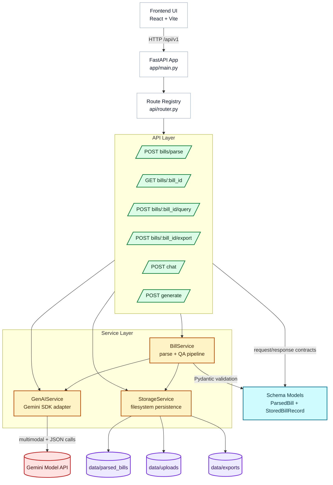

# Backend Code Walkthrough

This document explains how the backend is structured and how a request flows through the system.

## Architecture Overview

The backend has 4 layers:

1. App setup
2. API routes
3. Schemas
4. Services

Request flow:

- FastAPI starts in [app/main.py](app/main.py)
- Routes are registered in [app/api/router.py](app/api/router.py)
- Input/output contracts live in [app/schemas/bill.py](app/schemas/bill.py) and [app/schemas/genai.py](app/schemas/genai.py)
- Business logic is in [app/services/bill_service.py](app/services/bill_service.py)
- Gemini integration is in [app/services/genai_service.py](app/services/genai_service.py)
- File persistence is in [app/services/storage_service.py](app/services/storage_service.py)

### Visual Architecture Diagram

## 1) App Startup

[app/main.py](app/main.py) creates the FastAPI app, configures CORS, and mounts all routes under `/api/v1`.

Key behavior:

- Swagger docs at `/docs`
- ReDoc at `/redoc`
- All business routes prefixed with `/api/v1`

## 2) Central Configuration

[app/core/config.py](app/core/config.py) loads settings from `.env` via `pydantic-settings`.

Important settings:

- `genai_provider`
- `gemini_api_key`
- `gemini_model`
- `parsed_bills_dir`, `exports_dir`, `uploads_dir`

## 3) Route Registry

[app/api/router.py](app/api/router.py) combines:

- health routes
- genai/chat routes
- bills routes

This file only wires route modules; it does not contain business logic.

## 4) Chat Endpoints

[app/api/routes/genai.py](app/api/routes/genai.py) exposes:

- `POST /api/v1/chat`
- `POST /api/v1/generate` (alias)

Both use `_run_chat()` which calls `genai_service.generate(...)` and maps service errors to HTTP:

- `501` unsupported provider
- `500` bad config (for example missing API key)
- `502` upstream Gemini failure

Schemas are defined in [app/schemas/genai.py](app/schemas/genai.py).

## 5) Bill Endpoints

[app/api/routes/bills.py](app/api/routes/bills.py) exposes:

- `POST /api/v1/bills/parse`
- `GET /api/v1/bills/{bill_id}`
- `POST /api/v1/bills/{bill_id}/query`
- `POST /api/v1/bills/{bill_id}/export`

Responsibilities:

- Validate uploaded files
- Call service layer
- Translate service exceptions to HTTP responses
- Return typed Pydantic responses

## 6) Data Schemas

[app/schemas/bill.py](app/schemas/bill.py) defines:

- `BillItem` for line items
- `TaxBreakdownEntry` for detailed tax components (CGST/SGST/IGST/etc.)
- `ParsedBill` as the extracted bill structure
- `StoredBillRecord` as persisted bill + metadata wrapper
- request/response models for bill query and export

Design pattern:

- `ParsedBill` = extracted business data
- `StoredBillRecord` = persisted artifact with source metadata and timestamp

## 7) Bill Extraction Pipeline

Core logic is in [app/services/bill_service.py](app/services/bill_service.py).

### Two-step extraction

1. Image -> transcription via `generate_from_image(...)`
2. Transcription -> structured JSON via `generate_json(...)`

Why this helps:

- Vision models transcribe text well
- Structured normalization from text is more reliable than direct image-to-JSON

Prompts in this file enforce:

- no hallucinations
- numeric monetary values
- tax breakdown extraction (including component and charge-level taxes)
- raw text preservation in backend record

Main methods:

- `parse_bill_image(...)`
- `parse_and_store(...)`
- `answer_question(...)`

## 8) Gemini Integration

[app/services/genai_service.py](app/services/genai_service.py) centralizes all Gemini SDK calls.

Key methods:

- `_validate_provider()` checks provider and API key
- `_generate_content(...)` performs actual SDK call
- `generate(...)` for plain text
- `generate_json(...)` for schema-driven JSON output
- `generate_from_image(...)` for multimodal image + prompt input

It also handles malformed model JSON safely and raises clean runtime errors.

## 9) Storage Layer

[app/services/storage_service.py](app/services/storage_service.py) handles filesystem persistence.

What it does:

- Ensures data folders exist
- Saves uploaded images
- Saves parsed records in `data/parsed_bills`
- Loads records by `bill_id`
- Exports bill-only JSON to `data/exports`

This project intentionally uses JSON files instead of a database for simplicity.

## 10) Parse Request End-to-End Flow

For `POST /api/v1/bills/parse`:

1. Route validates image file
2. `bill_service.parse_and_store(...)` is called
3. Upload image is saved
4. Gemini transcribes image text
5. Gemini structures transcription to `ParsedBill`
6. Schema validation runs
7. Record is saved as `StoredBillRecord`
8. Response is returned to frontend

## 11) Bill Question Flow

For `POST /api/v1/bills/{bill_id}/query`:

1. Stored parsed bill is loaded
2. Prompt is constructed using bill JSON
3. Gemini answers using the parsed bill only
4. Route returns `{ bill_id, answer, provider }`

## 12) Why This Structure Works

- Thin routes
- Strong Pydantic contracts
- Service-first business logic
- Provider integration isolated to one service
- Storage isolated from parsing logic

This separation makes testing, debugging, and future replacement (DB/provider changes) easier.

## 13) Recommended Reading Order

To understand the backend quickly, read in this order:

1. [app/main.py](app/main.py)
2. [app/api/routes/bills.py](app/api/routes/bills.py)
3. [app/services/bill_service.py](app/services/bill_service.py)
4. [app/services/genai_service.py](app/services/genai_service.py)
5. [app/schemas/bill.py](app/schemas/bill.py)
6. [app/services/storage_service.py](app/services/storage_service.py)
